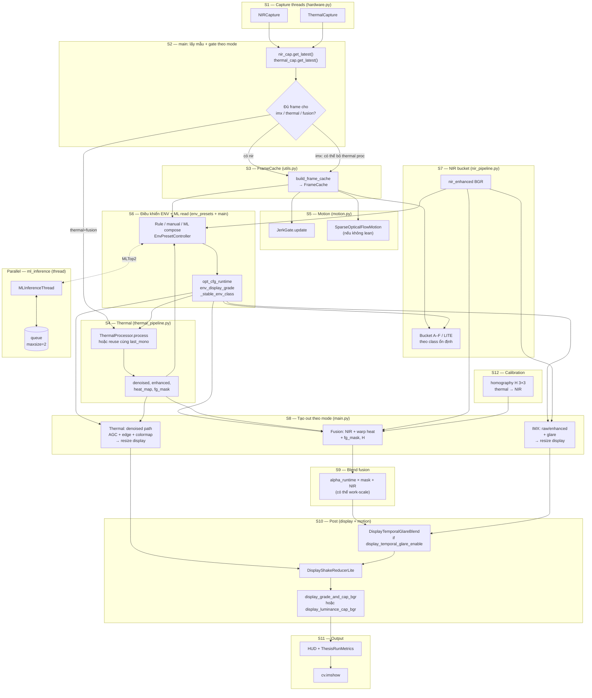
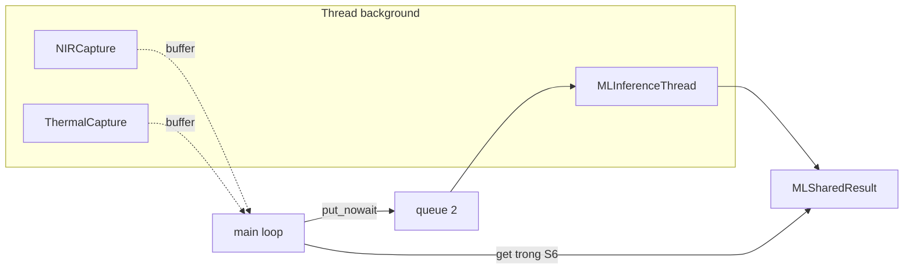
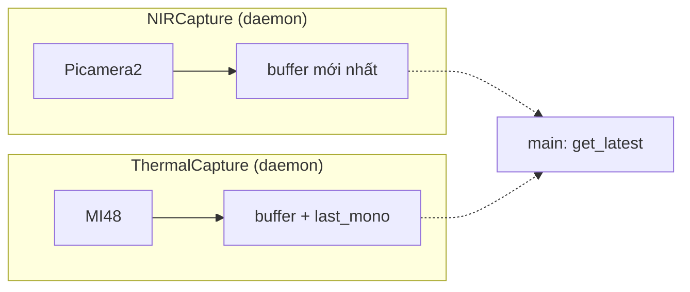
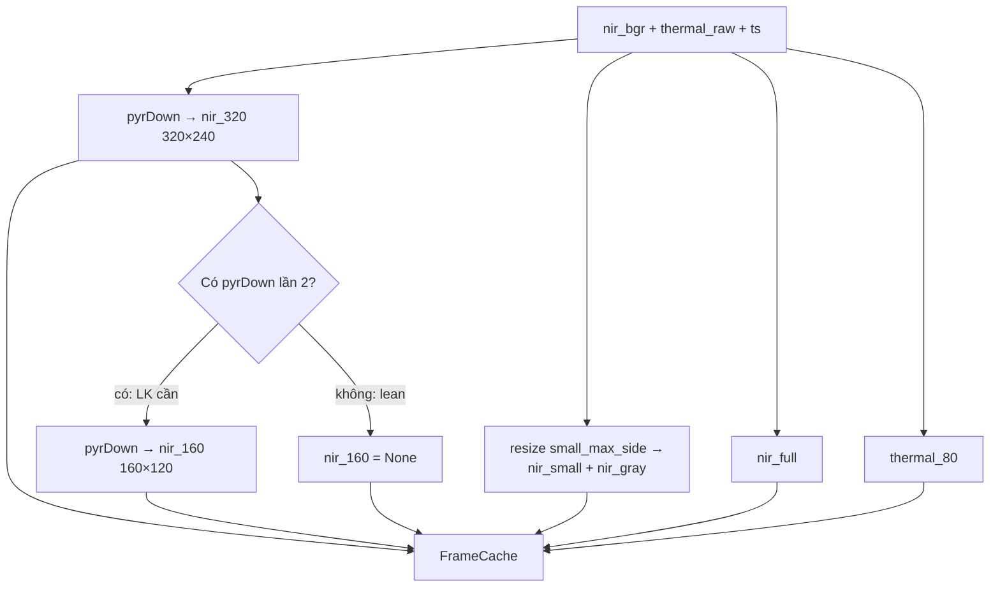
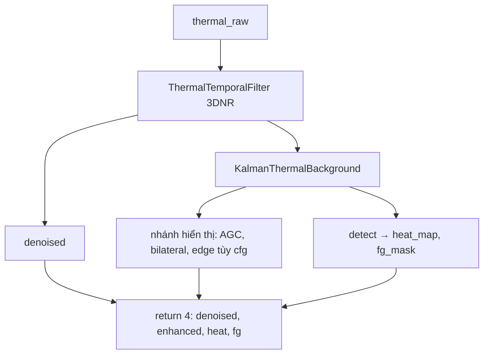
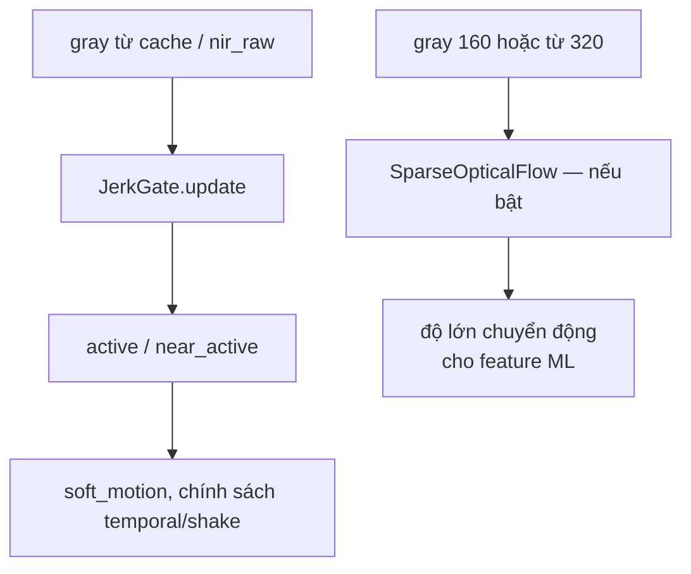
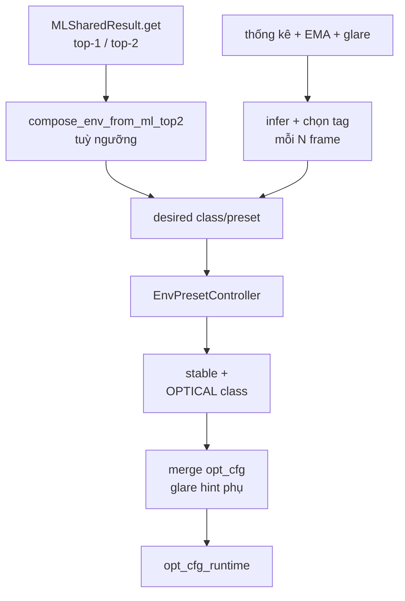
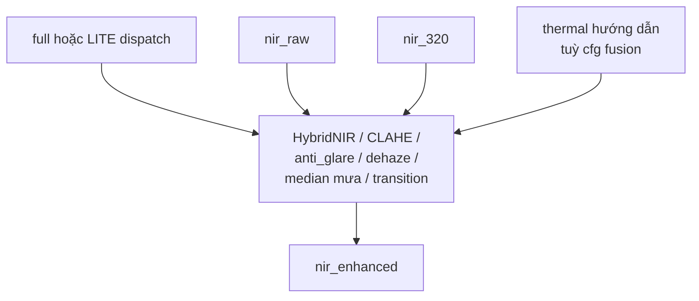
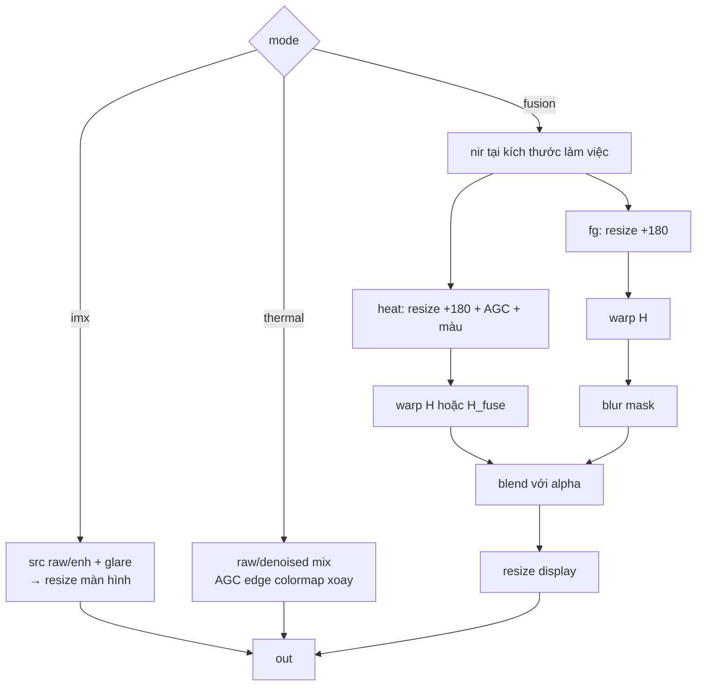
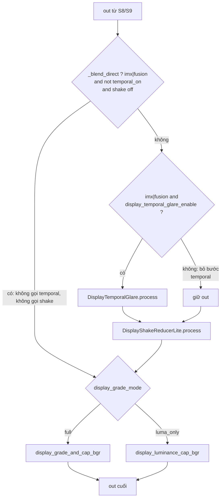

# SmartBinocular — Pipeline (tổng quan & chi tiết)

Tài liệu tham chiếu cho runtime **`src/smartbinocular/`**; `main.py` điều phối toàn bộ. `legacy/md/` và `legacy/py/` **không** nằm trên đường chạy thật.

**Cách đọc:** (1) **Chỉ mục S1–S12** dưới đây. (2) **Sơ đồ tổng** — mô tả *phụ thuộc dữ liệu & cấu hình* giữa các khối; **không** thay cho thứ tự gọi hàm (xem **§3**). (3) **Bảng 1.1** — **mỗi nhãn trên sơ đồ** có một dòng, tên cột 1 trùng nhãn. (4) **Bảng 1.2** — chỉ các bước **bật/tắt** được (config/CLI/runtime); *không* liệt kê khối đã gỡ khỏi mã. (5) **§3** = thứ tự thực trong `main.py`. (6) **8 mục chi tiết** (sơ đồ + bảng cùng nhãn). (7) Phụ lục.

---

## Chỉ mục: sơ đồ lớn ↔ sơ đồ chi tiết

| Mã trên sơ đồ lớn | Nội dung | Sơ đồ / mục chi tiết (cuối file) |
|-------------------|----------|----------------------------------|
| S1 | Thread NIR / Thermal | **§5** Chi tiết 1 |
| S2 | `get_latest` + gate theo mode | Bảng mục 1.1; thứ tự thật **§3** |
| S3 | `FrameCache` | **§6** Chi tiết 2 |
| S4 | `ThermalProcessor` | **§7** Chi tiết 3 |
| S5 | Motion: Jerk + LK | **§8** Chi tiết 4 |
| S6 | ENV + ML (đọc) → `opt_cfg` | **§9** Chi tiết 5; song song **§4** |
| S7 | NIR bucket + glare | **§10** Chi tiết 6 |
| S8 + S9 | Compositor + blend fusion | **§11** Chi tiết 7 |
| S10 | Post | **§12** Chi tiết 8 |
| S11 | HUD + metrics + `imshow` | Bảng mục 1.1 |
| S12 | Homography `H` | Bảng mục 1.1; fusion **§11** |

---

## 1. Sơ đồ tổng quan lớn (lớp + quan hệ, **không** phải thứ tự dòng mã 1:1)

**Bắt buộc:** Cạnh từ `ENV` / `CFG` tới `NB`, `TH`, `IMX`… mô tả *preset + `opt_cfg` điều khiển* các đường xử lý, **không** mô tả thứ tự clock trong một frame. Trên từng vòng lặp, mã thực thi gần **S2 → S3 → S7 (bucket) → S4 → S5 → S6 (ENV) →…**; **bucket** đọc **`_stable_env_class` đã cập nhật ở kết thúc ENV frame *trước***. Chi tiết: [§2](#2-ghi-chú-s7-bucket-trên-từng-frame), [§3](#3-thứ-tự-thực-trong-mainphần-quan-trọng).

**S6** là **mặt phẳng điều khiển** — không tạo buffer ảnh chính. **ML inference** ở **thread** + hàng đợi; `main` `get()` trong ENV — [§4](#4-luồng-song-song-ml--capture).

### 1.1 Bảng — từng **nhãn** trên sơ đồ tổng (đối chiếu 1:1)

Cột **Nhãn** copy khái niệm từ sơ đồ (rút gọn xuống dòng nếu cần). Cột **Mã** = ID nút Mermaid (để dò bằng mắt: `NIRCapture` = `NT`, …).

| Nhãn (như trên sơ đồ) | Mã | `src` / vị trí | Inputs (tóm tắt) | Outputs (tóm tắt) | Nhiệm vụ |
|----------------------|-----|----------------|------------------|-------------------|----------|
| `NIRCapture` | NT | `hardware.NIRCapture` | Picamera2 | Buffer; `get_latest()` → BGR (vd 640×480) | Thread nền NIR. Có thể tạm dừng: `pause_nir_capture_when_thermal_only` |
| `ThermalCapture` | TT | `hardware.ThermalCapture` | MI48 | Buffer; `get_latest()`; `get_last_mono()` | Thread nền nhiệt. Có thể tạm dừng: `pause_thermal_capture_when_imx_only` |
| `nir_cap.get_latest() thermal_cap.get_latest()` | GL | `main` vòng lặp | — | Cặp frame mới | Đồng bộ kéo mẫu từ S1 |
| `Đủ frame cho imx / thermal / fusion?` | GATE | `main` | `mode` | Pass / `continue` + sleep | Không chạy nửa frame (nhất là fusion) |
| `build_frame_cache → FrameCache` | FC | `utils.build_frame_cache` | `nir_bgr`, `thermal_raw`, `ts` | `FrameCache` | Pyramid + gray + thermal đồng bộ; `nir_160` tùy `skip_nir_160` |
| `ThermalProcessor.process hoặc reuse cùng last_mono` | TH | `thermal_pipeline.ThermalProcessor` | `thermal_raw` | 4 mảng hoặc reuse | 3DNR, nền, detect. Reuse: `skip_thermal_reprocess_when_same_timestamp` + cùng mono id |
| `denoised, enhanced, heat_map, fg_mask` | THO | (kết quả `process`) | — | Cùng lưới nhiệt | Tensor dùng cho hiển thị nhiệt + fusion + E1 (nếu bật) |
| `JerkGate.update` | JK | `motion.JerkGate` | `nir_raw` / `nir_gray` từ cache | `active`, `near_active`, `last_score` | Phát hiện jerk; quyết định soft motion / cờ tới temporal&shake |
| `SparseOpticalFlowMotion (nếu không lean)` | LK | `motion` (`lk_flow`) | mặt phẳng xám 160×120 hoặc từ 320 | `motion_magnitude`, v.v. | **Tắt** khi `_lean_lk` / `--no-lk` (không tạo khối khác) |
| `Rule / manual / ML compose EnvPresetController` | ENV | `env_presets` + `main` | gray, EMA, glare, `MLTop2?`, `env_mode` | `desired` → `update()` | Nguồn quyết định preset trước khi ổn định |
| `opt_cfg_runtime env_display_grade _stable_env_class` | CFG | cùng khối ENV + merge | preset ổn định + `opt_cfg_base` | Dict chạy + grade + tên lớp quang học | Merge **trong** S6 **cùng** frame; `opt_cfg_runtime` dùng ngay cho compositor/post **frame đó**; **`_stable_env_class` cho bucket** là kết quả sau cùng của S6 và **áp vào bucket ở frame sau** |
| `Bucket A–F / LITE theo class ổn định` | NB | `main` + `nir_pipeline` | `nir_raw`, `resolve_optical_bucket(…, lite=…)` | Nhánh xử lý theo bảng; có bucket `RAW` (đêm) | Chọn hàm NIR; **dùng class từ ENV frame trước** |
| `nir_enhanced BGR` | NE | cùng | `nir_enhanced` BGR cùng kích thước `nir_raw` | — | Nguồn NIR (trừ khi chọn raw) cho IMX/fusion |
| `IMX: raw/enhanced + glare → resize display` | IMX | `main` nhánh `mode=="imx"` | raw vs enhanced, `nir_glare_eval` / nén tùy `thermal_proc.anti_glare_enabled` | `out` tới `display_size` | Một cảm biến; có `show_raw` / auto raw |
| `Thermal: denoised path AGC + edge + colormap → resize display` | THD | `main` nhánh `thermal` | `thermal_raw` / `thermal_denoised` / AGC / edge / colormap / xoay 180 | `out` | Không qua `DisplayTemporalGlare` (nối tới shake trực tiếp trong sơ đồ) |
| `Fusion: NIR + warp heat + fg_mask, H` | FUS | `main` `fusion` | NIR, `heat_map`, `fg_mask`, `H` hoặc `_H_fuse` | `out` (gradient hoặc fg mask; có khi chỉ NIR) | `fusion_overlay_mode` ∈ `gradient` \| `fg_mask` (CONFIG key; local var `_fusion_mode_pre`) |
| `homography H 3×3 thermal → NIR` | H | `load_homography` (lúc init) | JSON `HOMOGRAPHY_PATH` | `H` + meta | Dùng fusion; work-scale: `_homography_scaled_to_work_size` |
| `alpha_runtime × mask + NIR (có thể work-scale)` | BL | (nhánh bên trong fusion, `main`) | `alpha_runtime`, mặt nạ, `nir_work` | `out` (work size) trước `resize` cuối | Trộn heatmap+mask; chưa phải `display_size` nếu work \< display |
| `DisplayTemporalGlareBlend if display_temporal_glare_enable` | TG | `display_pipeline` | `out`, `nir_need_compress`, `jerk_gate`, `soft_motion_active` | `out` | **Chỉ** `mode in ("imx","fusion")` khi bật; default config gốc `True` — profile throughput có thể tắt (xem `config.py` + RPI map) |
| `DisplayShakeReducerLite` | SK | `motion` | `out`, `jerk_active`, `soft_motion_active` / temporal đã blend | `out` | `display_shake_mode` off\|blend\|shift; default off |
| `display_grade_and_cap_bgr hoặc display_luminance_cap_bgr` | LAB | `display_pipeline` | `out`, `env_display_grade`, `display_l_max` | `out` | `display_grade_mode` **full** → `display_grade_and_cap_bgr`; **luma_only** → `display_luminance_cap_bgr` (có thể bỏ cap khi gate luma) |
| `HUD + ThesisRunMetrics` | HUD | `main` + `metrics` | `out`, trạng thái, FPS, tag | Chữ, reticle, `ThesisRunMetrics.record_frame` | Lớp chữ/đồ thị. **E1** vẽ vòng tròn blob (nếu bật) lên `out` **sau** post, **trước** block text lớn HUD |
| `cv.imshow` | SH | `main` | `out` bgr cuối | Cửa sổ | Hiển thị; phím tắt ở vòng lặp |
| `MLInferenceThread` | MLT | `ml_inference` | lấy từ `queue` | Cập nhật `MLSharedResult` | RF/EMA; daemon |
| `queue maxsize=2` | Q | cùng module | `put_nowait` vector đặc trưng | Hàng đợi tới MLT | Đầy thì bỏ (non-blocking) |

**Ba mạch nói tắt:** (1) **Pixel tuyến tính (§3):** S2→S3→S7 sớm→S4→S5→S6→…→S8→(S9)→S10→overlay blob→S11. (2) **Nhiệt → compositor / fusion:** S4 → THD hoặc FUS+BL. (3) **Điều khiển:** `opt_cfg` + `_stable_env_class` — bucket frame *n* dùng ổn định từ hết frame *n−1*.

### 1.2 Bảng — bước **tùy chọn** (bật/tắt; *không* gồm khối đã xoá hẳn)

| Tên trên tài liệu / mã | Điều kiện tắt (thường gặp) | Nhiệm vụ |
|------------------------|----------------------------|----------|
| Ghi feature JSONL | `ml_logger` + `ML_LOG_INTERVAL`; `_ml_log_enabled` | Ghi dữ liệu huấn luyện, không hàng infer |
| Hàng đợi infer `put_nowait` + `MLInferenceThread` | `ML_INFERENCE_ENABLED`, fail extractor → không gửi | Suy luận môi trường bất đồng bộ |
| LK (SparseOpticalFlow) | `lean` / `--no-lk` / `lean_disable_lk` | Đặc trưng chuyển động cho ML; nếu tắt, coi như bước không chạy |
| E1 `ThermalAnomalyDetectorLite` + blob | `phase1_e1_enabled` + `_lean_e1` / `--no-e1` + phím `E` | Phát hiện blob **sau** ENV, **trước** `fps_counter.tick` + compositor; vẽ circle **sau** post (xem dòng HUD) |
| MAD `ThermalMADAnomalyDetector` | `lean` MAD / flag | Có thể thay thế blob E1 khi bật |
| Vẽ blob / cảnh báo sector trên `out` | `phase1_e1`… + có blob; `phase1_alert_enabled` | Chỉ vẽ khi cấu hình bật — không tạo “stage” riêng trên sơ đồ tổng |
| BRISQUE (ghi metrics) | `_iqa_enabled` + subsample 1/30 | Chất lượng ảnh, không ảnh hưởng pixel pipeline bắt buộc |
| `DisplayTemporalGlareBlend` | `display_temporal_glare_enable: false` | Nếu tắt, nhảy từ `out` S8/9 tới `DisplayShakeReducerLite` (xem **§12**) |
| `nir_160` trong FrameCache | `skip_nir_160` khi tắt LK | Giảm chi phí pyramid |

*Không liệt kê ở đây:* nhánh mã/CLI đã bị xoá sạch (không còn symbol trong `src/smartbinocular/`).

---

## 2. Ghi chú: S7 (bucket) trên từng frame

Trên từng lần lặp, `main` tính **NIR bucket** (imx/fusion) **trước** khi gọi `ThermalProcessor` và **trước** khối **ENV** đầy đủ. Bảng môi trường ổn định `_stable_env_class` mà bucket dùng lấy từ kết quả `env_controller.update` của **frame trước**. Sau khi ENV chạy xong trong frame hiện tại, class/preset cập nhật **dùng cho frame sau** (cùng với cập nhật tham số NIR/thermal nếu preset đổi).

---

## 3. Thứ tự thực trong `main` (phần quan trọng)

| Bước | Nhãn | Nội dung thực thi |
|------|------|-------------------|
| 1 | S2 | `get_latest` + gate theo `mode` |
| 2 | S3 | `build_frame_cache` (tùy `skip_nir_160`, `framecache_small_max_side`) |
| 3 | **S7a** | NIR bucket nếu `mode ∈ (imx, fusion)` — dùng `_stable_env_class` từ **frame trước** |
| 3b | — | `mode == thermal` + có NIR: EMA độ sáng, **không** bucket |
| 4 | S4 | `ThermalProcessor.process` hoặc reuse cùng `last_mono` (thermal/fusion) |
| 5 | S5 | `JerkGate.update`; rồi LK nếu không `lean` (gray từ `nir_160` hoặc pyrDown 320) |
| 6 | — | Nạp `nir_gray_cache` / glare cache cho block ENV (từ `FrameCache` khi có) |
| 7 | S6 | `env_mode` + `MLSharedResult.get` (auto) + `infer_env_tags` / chọn `desired` + `env_controller.update` + `merge_opt_cfg` + cập nhật thermal enhancer, E1 snapshot, `temporal_glare.prev_weight`, … |
| 8 | — | ML feature JSONL (mỗi `ML_LOG_INTERVAL`) nếu bật — **cùng thread** |
| 9 | — | `put_nowait` vector infer mỗi `ML_INFERENCE_INTERVAL` — **hàng đợi tới** `MLInferenceThread` |
| 10 | E1/MAD | `ThermalAnomalyDetectorLite` / `ThermalMADAnomalyDetector` (nếu bật) — **sau** 8–9, **trước** FPS |
| 11 | — | `fps = fps_counter.tick()` rồi **compositor** S8 (IMX / thermal / fusion) |
| 12 | S8–S9 | Tuỳ `mode`: `resize` IMX, pipeline thermal, hoặc fusion (gradient / fg_mask + warp + blend) |
| 13 | S10 | Khối `with _stage_profiler("blend")`: temporal (imx/fusion) → `shake` → `display_grade` **hoặc** `luma` cap theo `display_grade_mode` |
| 14 | — | E1 vẽ vòng lên `out` (nếu có blob); dòng cảnh báo sector; `ThesisRunMetrics.record_frame` |
| 15 | S11 | Lớp HUD chữ/reticle/ML debug (khối `hud`); rồi `imshow` |

S12 (`H` / `_H_fuse`) từ `load_homography` **lúc init**; có thể scale mỗi frame cho fusion tùy `fusion_warp_work_scale`.

---

## 4. Luồng song song: ML + capture

| Thành phần | Chạy ở đâu | Nối với `main` |
|------------|------------|----------------|
| `NIRCapture` / `ThermalCapture` | Thread riêng | Buffer; `get_latest` / `get_last_mono` |
| `MLInferenceThread` (tuỳ bật) | Thread `daemon` | `queue` `maxsize=2`; `main` gọi `put_nowait` vector; **đọc** `MLSharedResult.get()` trong S6. Đầy hàng đợi → **bỏ** vector (lấy mới nhất). |
| Ghi JSONL feature | Cùng thread `main` | Cách N frame; không nên chặn lâu. |

| Nhãn sơ đồ | Nghĩa |
|------------|--------|
| `NIR` | `NIRCapture` (thread) |
| `TH` | `ThermalCapture` (thread) |
| `MLT` | `MLInferenceThread` |
| `M` | Vòng lặp `main` |
| `Q` | `queue` `maxsize=2` (đặc trưng) |
| `R` | `MLSharedResult` (latest top-1/top-2) |

---

## 5. Chi tiết 1 — S1: hai luồng capture

| Nhãn trên sơ đồ | `src` | Inputs | Outputs | Nhiệm vụ |
|-----------------|--------|--------|---------|----------|
| `Picamera2` | `NIRCapture.run` | cấu hình | frame trong buffer | Bắt NIR nền. |
| `buffer mới nhất` | cùng thread | từ `Picamera2` | bản mới nhất | Đồng bộ `get_latest()`. |
| `MI48` | `ThermalCapture.run` | bus cảm biến | frame nhiệt + id mẫu | Đồng bộ SPI/I2C. |
| `buffer + last_mono` | cùng | từ MI48 | last frame + `get_last_mono()` | Reuse nhiệt khi trùng id. |
| `main: get_latest` | `main` | gọi API capture | `nir_raw`, `thermal_raw` mỗi lần lặp | Nhịp lấy mẫu. |

---

## 6. Chi tiết 2 — S3: `FrameCache`

*Thực tế: `nir_160` **có thể bỏ** (`skip_nir_160` khi tắt LK); `max_side` cho gray có thể 64–128.*

| Nhãn trên sơ đồ | `src` | Inputs | Outputs | Nhiệm vụ |
|-----------------|--------|--------|---------|----------|
| `nir_bgr + thermal_raw + ts` | `build_frame_cache` | 3 tham số | Điểm bắt đầu pipeline cache | Cùng timestamp với cặp cảm biến. |
| `pyrDown → nir_320` | cùng | `nir_bgr` | `nir_320` 320×240 | Tầng kim tự tháp. |
| `Có pyrDown lần 2?` (Q1) | cùng | `skip_nir_160` | Rẽ `PD2` hoặc `N0` | Tắt khi LK tắt. |
| `pyrDown → nir_160` | cùng | từ `nir_320` | 160×120 BGR | Cho LK. |
| `nir_160 = None` (N0) | cùng | lean | `nir_160` rỗng | Tiết kiệm CPU. |
| `resize small_max_side → nir_small + nir_gray` | cùng | `nir_bgr` | `nir_small_bgr`, `nir_gray` | Proxy sáng nhanh. |
| `nir_full` | cùng | tham chiếu | full res | Nguồn tham chiếu. |
| `thermal_80` | cùng | `thermal_raw` | copy ~62×80 | Trùng cặp frame. |
| `FrameCache` (OUT) | `FrameCache` dataclass | tất cả nhánh trên | một struct | Tất cả consumer chung. |

---

## 7. Chi tiết 3 — S4: `ThermalProcessor` (ý niệm)

| Nhãn trên sơ đồ | `src` | Inputs | Outputs | Nhiệm vụ |
|-----------------|--------|--------|---------|----------|
| `thermal_raw` | đầu vào S4 | từ capture | 62×80 | Một frame nhiệt. |
| `ThermalTemporalFilter 3DNR` (TTF) | `thermal_pipeline` | `thermal_raw` | mượt tạm | Giảm nhiễu thời gian. |
| `KalmanThermalBackground` (KBG) | cùng | từ TTF / tầng tương đương | ước nền | Tĩnh / động. |
| `detect → heat_map, fg_mask` (DET) | cùng `process` | nền + tín hiệu | `heat_map`, `fg_mask` | Cho fusion (fg / gradient cần nhiệt). |
| `denoised` (DEN) | cùng | từ TTF | 8-bit | Cầu nối tới bước sau. |
| `nhánh hiển thị: AGC, bilateral, edge` (ENH) | cùng | từ cấu hình + nền | `enhanced` khi `compute_enhanced=True` | Trong `main`: `compute_enhanced=(mode != "fusion")` — **fusion** không tính `enhanced`, vẫn có `heat_map`/`fg_mask` cho overlay. |
| `return 4: denoised, enhanced, heat, fg` (TUP) | cùng | gói 4 | tuple | Một hợp đồng S4. |

---

## 8. Chi tiết 4 — S5: motion

| Nhãn trên sơ đồ | `src` | Inputs | Outputs | Nhiệm vụ |
|-----------------|--------|--------|---------|----------|
| `gray từ cache / nir_raw` | `main` | `FrameCache.nir_gray` hoặc full | Ảnh xám | Đồng bộ với S3. |
| `JerkGate.update` (JK) | `motion.JerkGate` | `nir_raw`, `precomputed_gray` | trạng thái, `last_score` | Jerk. |
| `active / near_active` (SC) | (trong gate) | so với ngưỡng | cờ mềm / cứng | `soft_motion_active` ở `main`. |
| `nir_160 green` (G160) | `main` | `nir_160[:,:,1]` hoặc pyrDown 320 | mặt phẳng LK | Khi LK bật. |
| `SparseOpticalFlow — nếu bật` (LK) | `lk_flow` | mặt phẳng trên | `motion_magnitude`… | Tắt: `_lean_lk` — không tạo “khối ảo”. |
| `độ lớn chuyển động cho feature ML` (MLFEAT) | cùng | state | số thực gửi log/infer tùy | Dù `infer` tắt, gate vẫn có. |
| `soft_motion, chính sách temporal/shake` (POL) | `main` | từ JK + `fix_nir_motion_gating` | cờ tới `blend` | Tránh IIR trùng (docstring `main.py`). |

---

## 9. Chi tiết 5 — S6: ENV + ML (đọc kết quả bất đồng bộ)

**ML** không chạy *trong* khối Python ENV — kết quả tới từ **thread** + `MLSharedResult`.

| Nhãn trên sơ đồ | `src` / hàm | Inputs | Outputs | Nhiệm vụ |
|-----------------|------------|--------|---------|----------|
| `MLSharedResult.get` (MLR) | `ml_inference` | cập nhật từ `MLInferenceThread` | `MLTop2` | Đọc không chặn trong nhánh `auto_rule`. |
| `compose_env_from_ml_top2` (COMPOSE) | `env_presets` | 2 lớp + 2 proba + ngưỡng | class/hint tùy | Thắng khi vượt `ml_confidence_threshold`. |
| `thống kê + EMA + glare` (GRAY2) | `main` trước ENV | `nir_gray_cache`, EMA, `nir_glare_eval` tùy | số, tuple glare | Lấy số liệu cho rule. |
| `infer + chọn tag mỗi N frame` (RULE) | `infer_env_tags_auto_rule` + chọn chu kỳ | từ `ENV_CLASSIFICATION_INTERVAL` | gợi ý môi trường | Khi ML không nắm quyền `desired`. |
| `desired class/preset` (DES) | `main` | ML hoặc rule hoặc manual / fallback | chuỗi preset mục tiêu | Vào `EnvPresetController`. |
| `EnvPresetController` (HYST) | `env_presets` | `desired` hợp lệ | preset ổn sau trễ | Hysteresis, debounce. |
| `stable + OPTICAL class` (STAB) | cùng + map | preset ổn | `_stable_env_class` cho bảng bucket ở **frame kế** | Dịch tên cũ → `ENV_CLASS` nếu cần. |
| `merge opt_cfg glare hint phụ` (MER) | `merge_opt_cfg_with_preset` + `apply_secondary_hint` | base + `ENV_PRESETS[stable]` | `opt_cfg_runtime` | Cập nhật `thermal_proc`, `nir_enhancer` khi đổi preset; E1 override. |
| `opt_cfg_runtime` (O) | output S6 | — | dict + `env_display_grade` | Dùng ngay cho compositor/post frame hiện tại. |

Bật/tắt: `env_mode` (off\|manual\|auto_rule), `env_classification_interval` (CONFIG key; local `ENV_CLASSIFICATION_INTERVAL`), `ML_INFERENCE_ENABLED`, `ML_INFERENCE_INTERVAL`, `ml_confidence_threshold`, v.v. — tắt hẳn: `env_mode: off` (ENV không đổi preset; vẫn merge base).

---

## 10. Chi tiết 6 — S7: NIR bucket + glare

*Trong bảng dispatch: dùng `resolve_optical_bucket(..., lite=nir_optical_lite)` để chuyển sang bảng rút gọn nếu cấu hình throughput.*

| Nhãn trên sơ đồ | `src` | Inputs | Outputs | Nhiệm vụ |
|-----------------|--------|--------|---------|----------|
| `full hoặc LITE dispatch` (MAP) | `resolve_optical_bucket(…, lite=…)` | `_stable_env_class` từ bước S6 trước | ký tự A–F hoặc `RAW` (đường đêm) | Một tầng chọn hàm. |
| `HybridNIR / CLAHE / …` (FNA) | `nir_pipeline` + nhiều hàm | từ bucket | BGR tăng cường | `nir_enhancer.process`, `nir_anti_glare_bgr`, `rain_*`, v.v. |
| `nir_raw` (RAW) | capture | 640×480 tùy | nguồn | Tất cả bucket. |
| `nir_320` (P320) | `FrameCache` | 320×240 | tùy chọn cho enhancer | Tăng tốc guided. |
| `thermal hướng dẫn` (GUIDE) | `main` | `nir_guided_filter_enable` + fusion + thermal | `thermal_guide` / `None` | Chỉ khi cấu hình bật. |
| `nir_enhanced` (ENH) | output bucket | cùng kích thước input | BGR | Vào IMX/fusion. |

*Glare metrics:* thường từ `nir_glare_eval` / cache trong S6; đường nén sáng khi lên màn ở **S8** IMX tùy `thermal_proc.anti_glare_enabled` (xem mã 1288+).

---

## 11. Chi tiết 7 — S8 + S9: hiển thị & fusion

| Nhãn trên sơ đồ | `src` | Inputs | Outputs | Nhiệm vụ |
|-----------------|--------|--------|---------|----------|
| `mode` (M2) | `main` | `mode` 3 trị | rẽ 3 cành | Compositor. |
| `src raw/enh + glare → resize` (IMX2) | cùng, nhánh `imx` | `show_raw` / `nir_enhanced` / glare | `out` tới `display_size` | Tùy `nir_anti_glare_bgr` khi nén. |
| `raw/denoised mix AGC edge colormap xoay` (THD2) | cùng, nhánh `thermal` | lựa chọn raw/denoise + AGC + edge + colormap + rot180 + resize | `out` | Không qua IIR NIR. |
| `nir tại kích thước làm việc` (F1) | fusion | `nir_work = resize(…, _nw_fuse, _nh_fuse)` | work buffer | Trước warp. |
| `heat: resize +180 + AGC + màu` (F2) | cùng | `heat_map` + edge (tùy) + colormap | BGR nhiệt | Chuẩn bị 3 kênh. |
| `fg: resize +180` (F3) | cùng | `fg_mask` | mask 8U | Cùng tầng số. |
| `warp H hoặc H_fuse` (W1) | cùng | `H` / `_H_fuse` từ work-scale | heat đã nắm | Single `warpPerspective` 4 chạng BGR+fg. |
| `warp H` (W2) | nếu tách từng tầng | — | (trong mã: BGR+fg 4ch một lần) | Tối ưu fusion `fg_mask`. |
| `GaussianBlur` mask (GB) | cùng | `fg` sau warp | mask mịn | Kernel `fusion_mask_blur_*` từ `opt_cfg`. |
| `blend với alpha` (BL) | cùng | `alpha_runtime`, mặt nạ, NIR | `out` u8 / float tạm | Nhánh `fg_mask` hoặc `gradient`. |
| `resize display` (RSZ) | cùng | nếu work \< display | lên `display_size` | Bước cuối fusion. |
| `out` (OUT2) | tất cả cành | BGR | vào S10 | IMX/thermal trực tiếp. |
| `_homography_scaled_to_work_size` | ngoài bảng trên, `main` init | `fusion_warp_work_scale` | `_H_fuse` | Tùy bật — giảm kích thước warp. |
| (ghi chú) | `main` nhánh `fg_mask` | `bgra = dstack(hm_color, fg)` | một `warpPerspective` | Sơ đồ tách W1/W2 cho dễ đọc; thực tế **một** warp 4 chanel. |

---

## 12. Chi tiết 8 — S10: post

Khối `with _stage_profiler("blend")` trong `main` — khớp thứ tự mã, không vẽ bước “đã xoá” (chỉ bỏ qua khi tắt cấu hình). `DisplayTemporalGlareBlend`: mặc định gốc trong `config.py` là **bật** (`true`); `RPI_THROUGHPUT_MAX_DEFAULTS` ghi **tắt** khi `rpi_throughput_max` — so `CONFIG` đang merge (xem lúc chạy).

*Nhiệt (`mode==thermal`):* `_blend_direct` luôn false (vì cần `mode in (imx, fusion)`), nên **luôn** qua `DisplayShakeReducerLite` sau nhánh bỏ temporal, rồi tới chọn DGM1.

| Nhãn (khớp sơ đồ / biến) | `src` | Inputs / điều kiện | Outputs | Nhiệm vụ |
|----------------------------|--------|-------------------|---------|----------|
| `out từ S8/S9` (IN2) | compositor | BGR | — | Điểm vào `with _stage_profiler blend`. |
| `_blend_direct` (BD) | `main` | `not display_temporal_glare_enable` ∧ `display_shake_mode==off` ∧ `mode in (imx, fusion)` | tới DGM1 trực tiếp khi true | Tối ưu: không gọi `temporal_glare` và không gọi `shake`. |
| `mode imx|fusion ∧ temporal` (TCHK) | cùng | mỗi lần `else` từ BD | bật/tắt `DisplayTemporalGlare` | Cảnh báo: **thermal** không vào nhánh này (so `TCHK` false → `NTP`). |
| `DisplayTemporalGlare.process` (TG2) | `display_pipeline` | `nir_need_compress`, `jerk_gate`, `soft_motion` | `out` IIR tùy | Như docstring cạnh 1444+ trong `main`. |
| bỏ bước temporal (NTP) | cùng | rẽ từ TCHK khi tắt | `_temporal_blend_applied = False` | Rồi vẫn tới `shake` (trừ khi `BD` đã thoát sớm). |
| `DisplayShakeReducerLite.process` (SK2) | `motion` | `jerk_active`, `soft_motion` hoặc đã IIR temporal | `out` | Mọi `mode` (sau cành trên), trừ khi `BD` true. |
| `display_grade_mode` (DGM1) | `main` + `opt_cfg` | chuỗi `full` / `luma_only` + `l_max` glare | rẽ LAB2 vs LUM2 | Cấp LAB hoặc chỉ cắt L. |
| `display_grade_and_cap_bgr` (LAB2) | `display_pipeline` | BGR, `env_display_grade`, `l_max` (và mức khi glare) | BGR | Một lần BGR↔LAB. |
| `display_luminance_cap_bgr` (LUM2) | cùng | BGR, `l_max` | BGR | Khi luma. |
| `out cuối` (OUT3) | — | BGR | E1 vẽ blob, HUD, `imshow` | Tới lớp S11. |

---

## 13. Kết nối tổng thể (một câu mỗi cặp)

| Từ | Đến | Vì sao |
|----|-----|--------|
| S1 | S2 | Thread nuôi buffer; `main` lấy theo nhịp. |
| S2 | S3 | Cần một lần resize/pyramid. |
| S2 | (trong mã) S7 sớm | Bucket NIR tính trước khi S4/S6. |
| S3 | S5 | Cùng proxy sáng. |
| S3 | S7 | `nir_320` / gray cho NIR. |
| S4 | S8 | Tensor nhiệt cho thermal / fusion. |
| S6 | toàn bộ cấu hình | Một `opt_cfg` thống nhất. |
| S7+S4+H | S9 | NIR đã xử lý + nhiệt đã căn. |
| S8 | S10 | Hậu xử lý màu/ổn định sau compositor. |
| Thread ML + Q | S6 | Cung cấp `MLTop2` không đồng bộ. |

---

## 14. Phụ lục

### A. `rpi_throughput_max` (gộp `CONFIG` trong `main`)

1. Nếu `rpi_throughput_max` → một lần `cfg.update(RPI_THROUGHPUT_MAX_DEFAULTS)` (profile RPi đầy đủ: lean HUD/features + fusion/thermal/NIR aggressive).  
2. CLI `--pipeline lean` kết hợp với `lean_disable_*`.  
Chi tiết key: `config.py`.

### B. GitNexus

Entry: `main()` trong `src/smartbinocular/main.py`. Cần phân biệt file: `file_path: src/smartbinocular/main.py`. Index đồ thị có thể trỏ tới `legacy` — ưu tiên mã dưới `src/smartbinocular`.

### C. Bật lại chất lượng “đầy đủ” (gợi ý)

Tắt `rpi_throughput_max` trong `CONFIG` hoặc ghi đè từng key; `nir_optical_lite: false`; bật LK/E1/MAD tùy nhu cầu. **`display_temporal_glare_enable`:** base `config.py` = `true`; profile RPi max ghi `false` — muốn IIR chói như base thì ghi đè `true` sau khi merge. `fusion_warp_work_scale: 1.0`; đo lại thời gian khung hình trên thiết bị.

### D. Tài liệu liên quan

- `CLAUDE.md` — tổng quan nhanh.  
- `README.md` — cài đặt.  
- `docs/PIPELINE_EVIDENCE_REGISTER.md` — nếu có trong cây.

---

*Bản này: sơ đồ tổng + bảng 1.1 khớp từng nhãn nút, bảng 1.2 chỉ bước bật-tắt, thứ tự `main.py` ở §3, cập nhật theo mã tại `src/smartbinocular/main.py` (bucket trước S4/S6, E1 trước FPS, post theo `_blend_direct`).*
