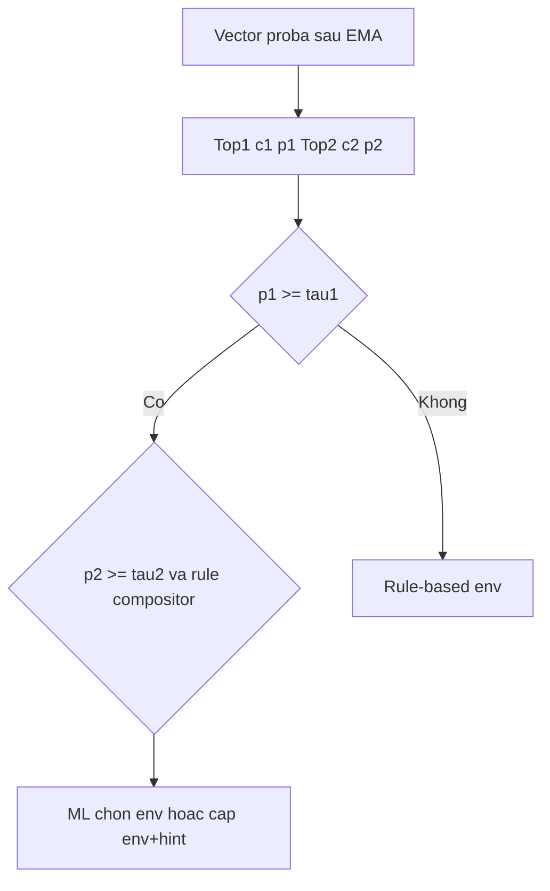

# Lý do chọn ngưỡng ML toàn cục (τ₁ top-1 & τ₂ top-2) — giải thích chi tiết

Tài liệu này trả lời **vì sao** trong [src/smartbinocular/config.py](../../src/smartbinocular/config.py) lại dùng **`ml_confidence_threshold` = 0,62** và **`ml_secondary_confidence_threshold` = 0,20**, và hai con số đó **đo bằng công cụ nào** trên **dữ liệu nào**. Đọc kèm bảng ECE ([ece_all_env_classes.md](ece_all_env_classes.md)) và hai CSV sweep bên dưới.

---

## Mục lục nhanh

1. [Hai ngưỡng dùng ở đâu trong pipeline?](#1-hai-ngưỡng-dùng-ở-đâu-trong-pipeline)
2. [Vì sao phải calibration trước khi nói “0,62” có nghĩa?](#2-vì-sao-phải-calibration-trước-khi-nói-062-có-nghĩa)
3. [τ₁ (top-1) — vì sao chọn 0,62?](#3-τ₁-top-1--vì-sao-chọn-062)
4. [τ₂ (top-2) — vì sao chọn 0,20?](#4-τ₂-top-2--vì-sao-chọn-020)
5. [So sánh nhanh các lựa chọn thay thế](#5-so-sánh-nhanh-các-lựa-chọn-thay-thế)
6. [Hạn chế phương pháp (để đọc đúng luận văn / review)](#6-hạn-chế-phương-pháp)
7. [Tài liệu & lệnh tái tạo](#7-tài-liệu--lệnh-tái-tạo)

---

## 1. Hai ngưỡng dùng ở đâu trong pipeline?

Trên RPi, `main.py` (chế độ `env_mode=auto_rule`) lấy vector xác suất đã qua EMA (`MLPosteriorEMA`), suy ra **hai lớp có xác suất cao nhất** và **hai xác suất tương ứng** \((c_1, p_1)\), \((c_2, p_2)\). Sau đó gọi **`compose_env_from_ml_top2`** trong [env_presets.py](../../src/smartbinocular/env_presets.py) với:

- `primary_threshold` = τ₁ = `ml_confidence_threshold`
- `secondary_threshold` = τ₂ = `ml_secondary_confidence_threshold`

**Ý nghĩa vận hành (rút gọn):**

| Thành phần | Vai trò |
| --- | --- |
| **τ₁** | “**Có đủ tin để để ML chọn preset môi trường chính không?**” Nếu \(p_1 < \tau_1\) → compositor trả \((\text{None}, \text{None})\) → hệ **không** dùng nhãn ML làm `env_class`, mà rơi về **rule-based** (heuristic NIR, v.v.). |
| **τ₂** | Chỉ có ý nghĩa **sau khi** τ₁ đã cho phép ML tham gia: nếu \(p_2 < \tau_2\) (hoặc không có lớp thứ hai hợp lệ) → **bỏ “gợi ý phụ”** (ví dụ fog/rain như hint), chỉ giữ nhãn top-1 đơn. Gợi ý phụ được dùng để **chỉnh nhẹ** `opt_cfg` qua `apply_secondary_hint` (dehaze nhẹ, gamma nhẹ, …), **không** thay preset chính kiểu “fog thay hết night”. |



**Tóm lại:** τ₁ quyết định **có tin ML hay không** (mức “cứng”); τ₂ chỉ **lọc độ ồn của xác suất hạng hai** trước khi cho phép một **hint** phụ — nên τ₂ thường **nhỏ hơn** τ₁ vì ta chấp nhận “lớp phụ” mờ hơn, nhưng vẫn phải đủ cao để không kích hoạt hint lung tung.

---

## 2. Vì sao phải calibration trước khi nói “0,62” có nghĩa?

Random Forest thô thường **không** cho xác suất khớp tần suất đúng trên thực tế. Pipeline training bọc **`CalibratedClassifierCV(..., method='isotonic')`**, nên `predict_proba` **gần với** “tần suất quan sát thấy đúng khi mô hình nói mức độ ~x” trên tập luyện — đó là nền tảng để **0,62 thực sự tương ứng** với mức tin ~62% theo nghĩa thống kê, chứ không phải số tùy hứng.

**ECE (Expected Calibration Error)** trên từng lớp (OOF) trong [ece_all_env_classes.md](ece_all_env_classes.md) đều **&lt; 0,05** (tệ nhất khoảng **0,043** ở `normal_day`) → sau calibration, mức 0,62/0,20 **có thể bàn luận được** như mức trên thang [0,1] đã hiệu chỉnh. Nếu ECE tệ, việc giữ 0,62 sẽ **khó biện hộ** trong thesis.

---

## 3. τ₁ (top-1) — vì sao chọn 0,62?

### 3.1. Công cụ đo: `tools/threshold_sweep.py`

- **Đầu vào:** bundle đã train (cùng `from_logs_test.jsonl` tách **không giao** với train).
- Với mỗi ứng viên **τ** trong lưới {0,50; 0,55; …; 0,75}: một dòng được **chấp nhận dùng ML** nếu **`max_k P(y=k) ≥ τ`** (tức “độ tự tin của lớp thắng” đủ cao). Đây chính là biến thể mà runtime so với **τ₁** thông qua **top-1 probability** (sau khi mô hình đã sắp xếp lớp thắng).
- Trên tập **được chấp nhận** đó, script tính **F1 dạng one-vs-rest (OVR)** cho **ba lớp đêm** `night_clear`, `normal_night`, `nir_night` (đêm là trọng tâm sản phẩm) rồi lấy **trung bình cộng (macro)**. Đồng thời báo **abstain** = tỷ lệ dòng **không** đại ngưỡng → sẽ do rule xử lý nếu áp cùng τ trong runtime tương tự.
- **Vì sao dùng macro F1 đêm?** Đó là cách **cô đọng** chất lượng trên lớp quan trọng nhất mà vẫn dùng một con số; không phải tối ưu toàn 9 lớp, mà phản ánh ưu tiên **night-vision** trong thesis / sản phẩm.

### 3.2. Số liệu gần đây (hold-out, bản cập nhật so với CSV trong repo)

| τ | Macro F1 (3 lớp đêm, trên dòng chấp nhận) | Abstain (từ chối ML) |
| --- | --- | --- |
| 0,62 | **0,9835** | **12,8%** |
| 0,65 | 0,9866 | 14,9% |

**Cách hiểu trade-off:** Tăng τ → **ít frame** dùng ML hơn (abstain cao hơn) → rule chạy nhiều hơn; F1 trên phần còn lại thường **tăng nhẹ** vì bạn bỏ đi nhiều dòng “nghi ngờ”. Ở **0,65** F1 tăng **~0,003** so với 0,62, nhưng phải trả thêm **~2 điểm phần trăm** frame không dùng ML — với ống kính 15 FPS, đó là nhiều thời gian bị rule.

**Kết luận chọn 0,62:** Nằm trên lưới sweep; cân bằng **chất lượng đêm** và **mức dùng ML**; cùng với ECE tốt, **0,62** là điểm “đọc được” trên thang xác suất đã hiệu chỉnh. Nếu ưu tiên **an toàn / ít lần ML sai** hơn là coverage, có thể chọn **0,65** (đã ghi trong [../production/env_classifier.json](../../models/production/env_classifier.json)).

**File số:** [threshold_sweep.csv](threshold_sweep.csv)

---

## 4. τ₂ (top-2) — vì sao chọn 0,20?

### 4.1. Công cụ đo: `tools/secondary_threshold_sweep.py`

- **Cố định τ₁ = 0,62** (cùng giá trị config hiện tại) để *tách* ảnh hưởng: chỉ xem thay **τ₂** thay đổi hành vi thế nào.
- Với mỗi dòng test: tính `predict_proba`, lấy **thứ tự từ cao xuống thấp** — \(p_1\) là xác suất lớn nhất, \(p_2\) là xác suất **hạng hai** (cùng tên lớp tương ứng). Đó khớp cách suy top-1/top-2 trên RPi.
- Gọi **đúng** hàm **`compose_env_from_ml_top2(..., primary_threshold=0.62, secondary_threshold=τ₂)`** với từng **τ₂** trong lưới — không tự tạo metric thay thế, để số liệu **khớp rule 1–2 và các rule 3–10** thật.

### 4.2. Các cột trong CSV nghĩa là gì?

| Cột / khái niệm | Nghĩa |
| --- | --- |
| `n_ml_active` | Số dòng mà compositor vẫn trả về **một** `env` chính từ ML (khác \((\text{None},\text{None})\) do fail τ₁) — tức ML “lái” được preset. |
| `n_with_hint` | Số dòng mà cặp trả về có **gợi ý phụ** (`apply_secondary_hint` sẽ có chuỗi hint). |
| `hint_rate_of_ml` = `n_with_hint / n_ml_active` | Trong số frame mà ML **đã** được dùng cho env chính, **bao nhiêu %** còn kèm thêm **hint** phụ. |
| **Phân vị p2** (khi \(p_1 \ge 0,62\)) | Mô tả *độ mạnh điển hình* của xác suất hạng hai khi top-1 đã đủ lớn; giúp đặt τ₂ theo mức “hiếm / mạnh” thay vì tùy. |

Với bản chạy lưu trong repo (hold-out, ~1843 dòng có \(p_1 \ge 0,62\)):

- **P90 của \(p_2\)** khoảng **0,20** → nghĩa là **~90%** tình huống có \(p_1\) đủ mạnh thì xác suất hạng hai vẫn **dưới** 0,20; chỉ **~10%** có “cột nhì” từ 0,20 trở lên. Đặt **τ₂ = 0,20** nghĩa là: **chỉ khi cột nhì mạnh hơn mức tối đa mà 90% mẫu thường đạt** thì mới xứng đáng bàn tiếp về hint (cùng các rule 3–10).

- Tại **τ₂ = 0,20**, `hint_rate_of_ml` ~ **4,7%** — tức trên tập test, khi ML đã được tin cho env chính, **chỉ vài %** còn bật thêm tầng hint (đúng với mục tiêu “hint mảnh, không lấn preset”).

**File số:** [secondary_threshold_sweep.csv](secondary_threshold_sweep.csv)

### 4.3. Tại sao **không** tối ưu F1 trực tiếp cho τ₂?

Nhãn dữ liệu chỉ cho biết **một lớp đúng mỗi dòng** (multiclass 9 lớp), **không** có “nhãn lớp thứ hai đúng” trên tập. Vì vậy không thể tính F1 trực tiếp cho chuỗi hint. Thay vào đó, ta (1) bám **phân bố p₂** sau calibration, (2) đo **tần suất gợi ý thực tế** qua compositor — đủ để **biện hộ** τ₂ trong luận văn dưới dạng *operational* + *distributional*, không tuyên bố tối ưu toàn cục.

---

## 5. So sánh nhanh các lựa chọn thay thế

| Thông số | τ₁ = 0,62 (đang dùng) | τ₁ = 0,65 (tùy chọn chặt) |
| --- | --- | --- |
| Đồ thị F1 + abstain | [threshold_sweep.csv](threshold_sweep.csv) | cùng file |
| Ưu điểm | Dùng ML cho nhiều frame hơn | F1 trên phần còn lại cao hơn một chút, ít “nhận ML khi mơ hồ” |
| Nhược điểm | — | Abstain ~+2% → nhiều frame về rule |

| τ₂ | Gợi ý dùng khi nào |
| --- | --- |
| **0,20** (đang dùng) | Cân bằng: gần P90(p₂\|p₁ đủ mạnh); hint ~4–5% trong ML-active (xem CSV). |
| **0,22** | Muốn **ít chỉnh opt phụ hơn**; hint còn ~3,4% (bản sweep). |
| **0,25** | Rất bảo thủ: hint ~2% trên tập test. |

---

## 6. Hạn chế phương pháp

- **Tập test** (`from_logs_test.jsonl`) phản ánh dữ liệu đã thu; **môi trường RPi tại hiện trường** có thể lệch — nên vẫn cần **Phase 3C** (đánh giá trên thiết bị) như [DEPLOY_ML_MODEL.md](../../legacy/md/DEPLOY_ML_MODEL.md).
- Sweep τ₁ dùng **max proba = p₁**; EMA trên thiết bị làm mượt vector — tỷ lệ abstain thực tế có thể lệch nhẹ, nhưng **thứ tự** ưu tiên τ vẫn hợp lý.
- τ₂ **không** tối ưu theo F1 gợi ý; chỉ **gắn** với phân bố p₂ + tần suất hint qua compositor.

---

## 7. Tài liệu & lệnh tái tạo

| Artifact | Vai trò |
| --- | --- |
| [threshold_sweep.csv](threshold_sweep.csv) | Sweep τ₁ |
| [secondary_threshold_sweep.csv](secondary_threshold_sweep.csv) | Sweep τ₂ (τ₁ cố định) |
| [ece_all_env_classes.md](ece_all_env_classes.md), [ece_night_classes.md](ece_night_classes.md) | ECE OOF từng lớp |
| [../production/env_classifier.json](../../models/production/env_classifier.json) | Snapshot số + `ml_gate_reference` |

Sau mỗi lần **retrain lớn** (đổi JSONL / model):

```bash
# Cần .venv với [ml-tools] (scikit-learn, …)
.venv/bin/python tools/threshold_sweep.py --out docs/tables/ml/threshold_sweep.csv
.venv/bin/python tools/secondary_threshold_sweep.py --primary 0.62 --out docs/tables/ml/secondary_threshold_sweep.csv
```

Cập nhật lại **bảng số** trong tài liệu này nếu CSV thay đổi đáng kể; sau đó rà lại ghi chú trong `config.py` / `env_classifier.json`.

---

*Bảng tóm tắc cấu hình: xem mục kết ở phiên bản rút gọn cũ — hai key `ml_confidence_threshold` = **0,62**, `ml_secondary_confidence_threshold` = **0,20**; τ₁/τ₂ thay thế: §5.*
